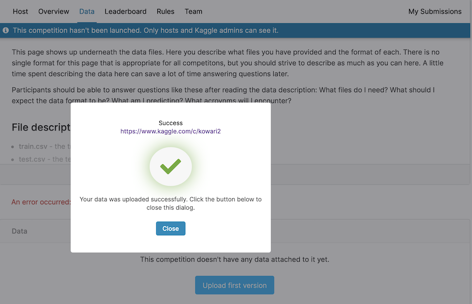

```{r setup, include=FALSE}
library(learnr)
knitr::opts_chunk$set(
  echo = FALSE,
  message = FALSE, 
  warning = FALSE,
  error = FALSE, 
  fig.retina = 3)
```

Image: [kowari](https://upload.wikimedia.org/wikipedia/commons/a/ac/Vakorejsek_ctyrprsty.jpg)

## Why?

Kaggle-in-class provides an objective way for students to assess their learning of predictive modeling. 

Examples from recent years:

- 2020: [Pictionary](https://www.kaggle.com/c/pictionary/leaderboard)
- 2019: [How Points End in Tennis](https://www.kaggle.com/c/monba2019)
- 2017: [Melbourne auction prices](https://www.kaggle.com/c/vitticeps/leaderboard)
- 2017: [Spam or Ham](https://www.kaggle.com/c/spam-or-not-spam/leaderboard)
- 2016: [Ames housing prices](https://www.kaggle.com/c/galah/leaderboard)
- 2016: [Who's speaking](https://www.kaggle.com/c/cockatoo/leaderboard)
- 2015: [Happy paintings](https://www.kaggle.com/c/monba/leaderboard)

## Getting data ready

### Choosing data

- the full set is not available to the students, to avoid plagiarism and use of unauthorized assistance.
- the data is not too easy, or too hard, to model so that there is some discriminatory power in the results.
- data should be relatively clean, to the point where the instructor has tested that a model can be fitted.
- contains some challenges, that make standard off-the-shelf modeling less successful, like different variable types that need processing or transforming, some outliers, large number of variables.
- if it is a classification challenge, it will work better with relatively balanced classes, because the overall accuracy is the easiest metric to use.

### Let's get wildlife sightings around Monash

I've pulled the occurrence records from https://www.ala.org.au. 

```{r  eval=FALSE}
monash <- read_csv("monash/monash.csv")
counts <- monash %>% count(`Vernacular name`, sort=TRUE)
keep <- c("Rainbow Lorikeet", "Galah", "Dusky Moorhen", "Umbrella tree", "Spotted Pardalote")
monash_ala <- monash %>% filter(`Vernacular name` %in% keep) %>%
  select(`Vernacular name`, Longitude, Latitude) %>%
  rename(name=`Vernacular name`)
save(monash_ala, file="monash/monash_ala.rda")
```

```{r}
library(tidyverse)
library(ggmap)
load("monash/monash_map.rda")
load("monash/monash_ala.rda")
ggmap(map) + 
  geom_point(data=monash_ala, aes(x=Longitude, y=Latitude, colour=name, shape=name), size=2, alpha=0.7) +
  scale_colour_brewer(palette="Dark2")
```

### Generate training and test sets

Using the `tidymodels` approach, break the data into a training and testing set. Use 50% because kaggle will further break the data.

```{r echo=TRUE}
library(tidymodels)
set.seed(444)
data_split <- initial_split(monash_ala, prop = 1/2)
monash_ala_tr <- training(data_split)
monash_ala_ts <- testing(data_split)
```

### Checks

Check that it properly stratified the classes.

```{r echo=TRUE, eval=FALSE}
monash_ala %>% count(name)
monash_ala_tr %>% count(name)
monash_ala_ts %>% count(name)
```

Check that the order of classes is a bit mixed

```{r echo=TRUE, eval=FALSE}
monash_ala_tr$name
monash_ala_tr$name
```

### Create unlabelled test set, solution and example solution data sets

Add an id column, so that when labels are removed, observations can be matched back to original set, or matched against solution set. Also the latest version of kaggle-in-class requires the important columns be named `Id` and `Category`. 

```{r echo=TRUE}
monash_ala_ts <- monash_ala_ts %>% 
  mutate(Id = 1:n()) %>%
  rename(Category = name) %>%
  select(Id, Category, Longitude, Latitude)
monash_ala_tr <- monash_ala_tr %>%
  rename(Category = name)
```


Need to provide an unlabelled test set for competitors. Save the full test set into a new file, clearly labelled and remove the labels in the test object. 

```{r echo=TRUE}
monash_ala_ts_labelled <- monash_ala_ts
monash_ala_ts <- monash_ala_ts %>% 
  mutate(Category = NA)
monash_ala_ts %>% print(n=5)
```

Create a solution set, and a sandbox (sample solution) set. 

```{r echo=TRUE}
monash_ala_solution <- monash_ala_ts_labelled %>%
  select(Id, Category)
monash_ala_example_solution <- monash_ala_solution %>%
  mutate(Category = sample(Category))
```

Write to files for kaggle upload.

```{r echo=TRUE}
write_csv(monash_ala_tr, path="kaggle_files/monash_ala_tr.csv")
write_csv(monash_ala_ts, path="kaggle_files/monash_ala_ts.csv")
write_csv(monash_ala_solution, path="kaggle_files/monash_ala_solution.csv")
write_csv(monash_ala_example_solution, path="kaggle_files/monash_ala_example_solution.csv")
```

## Check modeling

Its a good idea to provide a basic model as a helper for students to get started.

```{r eval=FALSE}
ct_spec <- decision_tree() %>% 
  set_engine("rpart") %>% 
  set_mode("classification")
monash_ala_rec <- recipe(Category~., data=monash_ala_tr)
monash_ala_fit <- 
  workflow() %>% 
  add_model(ct_spec) %>% 
  add_recipe(monash_ala_rec) %>%
  fit(data=monash_ala_tr)
```

```{r echo=TRUE}
library(rpart)
library(gt)
monash_ala_rp <- rpart(Category~., data=monash_ala_tr,
              control = rpart.control(cp = 0.0005, minsplit = 5)) 
# monash_ala_rp

monash_ala_ts_pred <- monash_ala_ts_labelled %>% 
  mutate(pred = predict(monash_ala_rp, monash_ala_ts, type="class"))

monash_ala_ts_pred %>% 
  count(Category, pred) %>%
  pivot_wider(names_from = pred, values_from = n, values_fill=0) %>% 
  gt()
```
```{r}
grid <- expand.grid(Longitude=seq(145.125, 145.1426, 0.00001),
                    Latitude=seq(-37.91749, -37.90448, 0.0001))
grid <- grid %>% 
  mutate(pred = predict(monash_ala_rp, grid, type="class"))
ggmap(map) + 
  geom_point(data=grid, aes(x=Longitude, y=Latitude, colour=pred), size=2, alpha=0.7) +
  scale_colour_brewer(palette="Dark2")
```

### Provide guidelines to students

For the pictionary challenge, [these](https://iml.numbat.space/project/project.html) were the instructions.

## Uploading to kaggle

### Finding the kaggle-in-class 

- Go to the main kaggle host a competition site: https://www.kaggle.com/c/about/host/
- Look for link `Interested in hosting a classroom competition? Visit Kaggle InClass »`
- This takes you to page on help and to create a competition: https://www.kaggle.com/c/about/inclass

### Create a competition

- Click `Create competition` link


- Give a short name and description


- Fill in overview


## Competition details

### Upload data

- Need to upload training, test, sample solution


- Successful uploads
    

- Need to agree to the rules


- Add a description of your data


## Styling

Style your page, add some nice images (make sure you own them, or proper sharing license)


## Managing access

Select access: recommend limited access only to people who have the link


## Choose evaluation metric

The metric you choose changes the format required for the solution file. If you have a balanced class problem, CategorizationAccuracy is simple and easy.


## Add solution set

### Upload solution file


### Set public/private split

Generally a value of 50% is good, it means that 50% of the test set will be held out and only revealed once the competition is finished.

### Upload sample submission file

You should upload your example solution set here, too. It will automatically be compared with the solution set, and is a check that this format will work for participant submissions. 


### Sandbox shows if example works


## Fill in some more text boxes

### Provide information on submission file format and variables

The Data tab has a text box where you explain the variables in the data, and any other details that you'd like to provide about the data.

### Evaluation explanation

The Evaluation tab has a box requiring you to explain how the evaluation is done.

## Final settings


### Set the due date

Note that the date time is UTC time, so you need to [convert to local time](https://www.worldtimebuddy.com/utc-to-australia-melbourne)

### Turn off teams

Its better to get individual submissions. Asking the students to make a username that consists of their monash username and a team name is a good idea for recognising the participants and which team they are on. 

Scores are assigned for a team, at the end of the competition by choosing the best result of team members.

### One submission per day

Setting a limit on the number of submissions per day helps the students manage their time, not get too involved in the task. And also gives them time to think about the model development.

## Go live

### Launch checklist


### Launch competition now

## Test it out!

This is your turn!

- Download the training data and test data. 
- Make a prediction of the test set.
- Upload your submission. 

## Resources

- [Kaggle site instructions](https://www.kaggle.com/about/inclass/overview)
- [Julia Polak's video instructions](https://www.youtube.com/watch?v=tqbps4vq2Mc&t=32s)
- [Github repo with this tutorial files](https://github.com/dicook/kowari)
